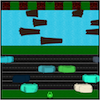

### Frogger3D
**Hayden Fuss**, <mailto:whfuss@ncsu.edu>  
**CSC 461**  
**12/12/2016**

### NOTE

This submission is past the end of 12/12 by an hour and should lose 27 points... however, I wanted to quickly to add sounds. It took about only an hour, so I'm hoping you'd be willing to count it for half the points (2.5) without the additional penalty, but I know rules are rules. If you have to deduct 27 points for this version despite the additional 2.5 points for sound, could you use my previous submission instead (it lost 9 points but had at least 5 points extra credit)? Or basically, the higher grade of the two submissions? Please email me if you want to discuss it. Thanks!

#### Description

The classic game with an extra dimension! Follow our daring frog from the third person perspective as he tries to get to safety. How many times can you win without dying? Use WASD to navigate, and press ESC to pause/unpause. You can also hold the Space bar to view the game from a top-down perspective view.

You can find a screencast of the game <a href="http://brix4dayz.github.io/frogger.html">here</a>.

#### Improvements Since Demo

On the day of the demo I didn't have much. I just got `.obj` file parsing working with a perspective camera following a model frog. I also had a box representing the car moving across the playing field, and a few textured planes showing some grass, water, and road.

Since then, I've implemented a lot. I finished my rendering engine, and then created a grid of ground tiles which were textured. I then got some model cars and tree trunks from the internet (urls in my source code). I then added some event forwarding to my game engine so I could move the model frog along the grid.

I then spent the last few days integrating `cannon.js` for my physics engine. Once I debugged my rendering and physics issues, I used the collision detection from `cannon.js` to create death and winning events for the game. Additionally, I used the physics engine to create a "smooth" jumping animation for the frog, which would allow it to land on logs and be dragged along. Lastly, I added sounds and used the win and death functions to keep track of the player's score (wins and deaths).

#### Source Code Overview

I sort of implemented a game engine which I'm calling `dali.js` for this assignment. Although I made a game object model, resource manager, rendering engine, and integrated `cannon.js`, the game loop and scene management became pretty coupled with the frogger code towards the end in order to just finish in time. I'll have to decouple the two, but for now, all the frogger game code is also in the `dali` folder under `src/main.js`.

I also used `glMatrix.js` for math for my graphics. You can find all of my game engine code under `dali/src` and you can see it all together in `dali.min.js` (it's not minified for grading sake). My HTML and images are under the `frogger` folder, but I'm loading the images from my personal GitHub <a href="http://brix4dayz.github.io/">portfolio</a> under the `img/frogger/` folder. Please contact me if there are any issues!

#### Extra Credit

+ Following perspective camera
+ Cartoon shading... please? It looks cool right? ;)
+ Tracking and displaying the number of deaths and wins
+ Sounds for:
	- Jumping (had to make an audio cache for playing multiple times quickly)
	- Hit By Car
	- Drowning
	- Burning
	- Winning
