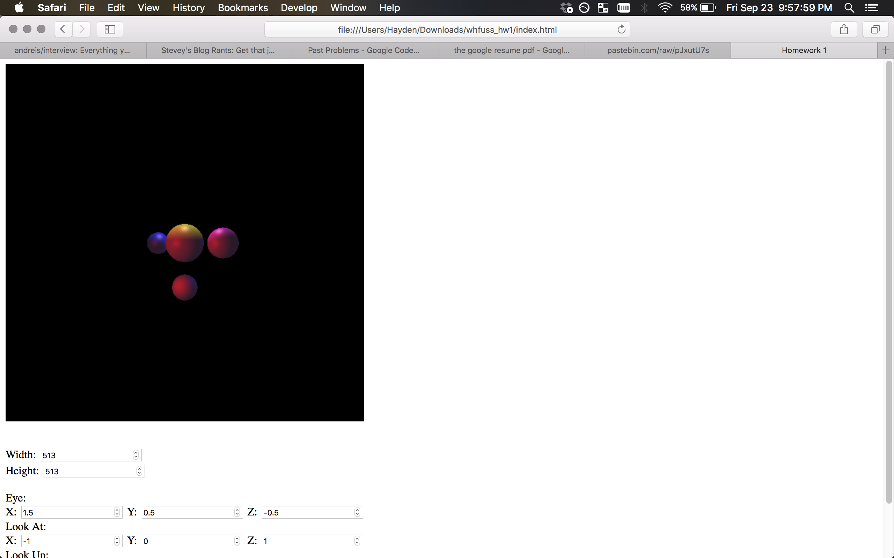

### Homework 1: Raycasting
### Hayden Fuss <mailto:whfuss@ncsu.edu>
### 09/23/2016
 

Within this tar are two files: `index.html` and `raycast.js`. All important code is within `raycast.js` while `index.html` contains the canvas and UI markup. No third party libraries are used or required. The UI allows the user to change the width and height of the canvas in pixels, as well as the coordinates of the eye, and the look-at and look-up vectors. Width and height must be an integer greater than 1, while the vectors allow all real numbers.

##### Extra Credit Supported

+ Arbitrarily sized viewports and images  
+ Arbitrary viewing setups  
+ Multiple and arbitrarily located lights  
+ Detect shadows during ray casting  

##### Screenshot (3 lights, red from eye, blue from opposite of eye, white from above)
I had to use Safari for trying my own input files because I was using pastebin.com and Chrome doesn't allow Cross-Origin-Resource-Sharing.  
 
</img>
